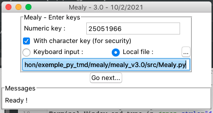
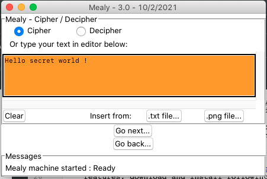
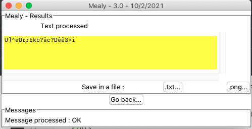
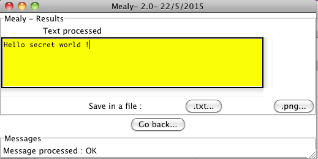

# Mealy project
Version 3.0 - 15/4/2021

Mealy is a small tool used to cipher and decipher a text file using a [Mealy machine](https://en.wikipedia.org/wiki/Mealy_machine).
Ciphered messages can be hidden in an image using steganography..

This Python tool can be used in batch mode with parameters or with a (GUI) Graphical User Interface based on Tkinter if user doesn't give any parameter.

Author : Thierry Maillard

Prerequisites
-------------
- Python 3.6+ must be installed on your computer. To check, open a Terminal Window and type in *python3 -V*. Download the latest Python version on web site : [https://www.python.org/downloads](https://www.python.org/downloads)
- Mealy project folder : [https://github.com/Thierry46/mealy](https://github.com/Thierry46/mealy)

Optional
--------
- To use steganographic features, download and install following python module with pip3 tool : Module Image Python Imaging Library (Pillow) : [https://python-pillow.org](https://python-pillow.org), maintained by Alex Clark (PIL Fork Author). Command to install or upgrade : _python3 -m pip install --upgrade Pillow_
- Module stepic version 0.5.0 : [https://launchpad.net/stepic](https://launchpad.net/stepic) : licence GNU GPL 2 maintained by Scott Kitterman and Lenny Domnitser. Command to install or upgrade : _python3 -m pip install --upgrade stepic_

Launching using GUI mode
------------------------
- On Windows, double-click on run_Mealy.py
- Launch run_Mealy.py in a terminal  : go to src directory and launch with command _python3 run_Mealy.py_
- On Mac, associate src/run_Mealy.py with Python Launcher : In finder select src/run_Mealy.py, right single click, Open with : Python Launcher App (3.9.1) (If not proposed, Python Launcher is located in /Applications/Python 3.9)

Ciphering a message
-------------------
- Enter your secret keys and then click Go Next ... button.

- Tell the program your secret message and then click Go Next ... 

- The ciphered text is displayed

- Save the result in a file or hide it in an image.

Deciphering a message
---------------------
- Enter your secret keys you received and then click Go Next ... button.

- In the cyphering window : Click on the Decipher radio button, Insert in the orange text editor the content of the ciphered file you received by clicking Insert from a file... button and then click Go Next ... 

- The deciphered message appears

- Save the result in a file or copy it in the clipboard.

Breaking the system
-------------------
This estimation is done according the algorithm described in the Programmer's guide.
Breaking the machine consist in discovering secret keys.

Knowing a message and its ciphered version :

If only one numeric key is used in the range [0; 9223372036854775807] to cypher the message and if the message is long enough, the maximum of attempt is around 5e18 at the condition user gives a long enough numeric key !
    If a second key of length 50 characters is used to modify alphabet order, the last number of attempt should be multiply by the maximum number of [cyclic possible permutation](https://en.wikipedia.org/wiki/Cyclic_permutation) of the alphabet (100 characters) : 100! / ((100-50)!*50).

Programming details
-------------------
See [programmer's guide](doc/programmers_guide.html).

Copyright
-----------
Copyright 2021 Thierry Maillard
This program is free software: you can redistribute it and/or modify it under the terms of the GNU General Public License as published by the Free Software Foundation, either version 3 of the License, or (at your option) any later version.
This program is distributed in the hope that it will be useful, but WITHOUT ANY WARRANTY; without even the implied warranty of MERCHANTABILITY or FITNESS FOR A PARTICULAR PURPOSE.  See the GNU General Public License for more details.
You should have received a copy of the GNU General Public License along with this program.  If not, see [http://www.gnu.org/licenses](http://www.gnu.orglicenses).

